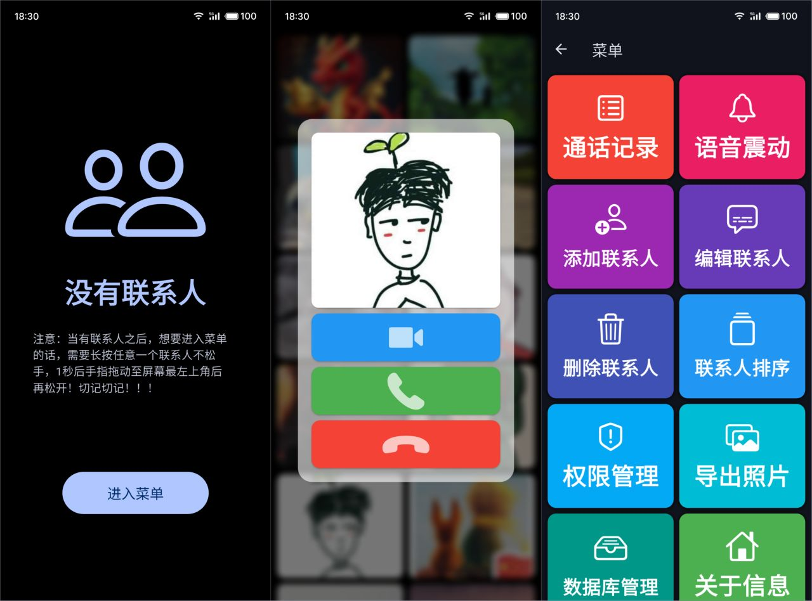

# Call打电话

一个工具类APP，用于老人快捷方便拨打家人电话、微信视频通话。使用Flutter编写。

## 功能特点

- 点击头像拨打普通电话、微信视频通话
- 添加、编辑、删除联系人姓名、图片、微信昵称/备注、语音播报内容
- 查询通话记录（电话、微信）
- 设置语音播报TTS音量、语速，点击联系人震动时长、强度
- 联系人拖动排序
- 权限管理（无障碍、打电话、相册、设置）
- 导出联系人照片
- 联系人数据库管理
- 手机系统信息查看

## 界面预览



## 开发环境

- Flutter 3.35.1
- Dart 3.9.0
- Gradle 8.12
- Gradle-plugin 8.9.1
- Kotlin 2.1.0

## 项目结构

```
Call
├─android              # Android工程配置
├─assets               # 资源文件目录
├─ios                  # iOS工程配置
├─lib                  # Flutter源代码目录
│  ├─data              # 数据类
│  ├─page              # 各个页面
│  ├─utls              # 工具类
│  └─main.dart         # APP入口
└─test                 # 测试目录
```
